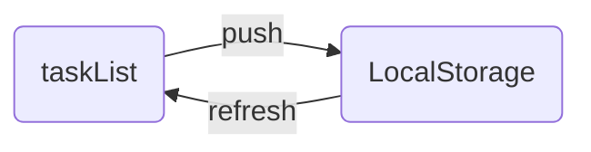

# Datos del listado
---
#WebStorage #JavaScript #JSON #Métodos #LocalStorage 

## Ideas clave
---
### Convirtiendo JSON en objeto de JavaScript 
## Notas
---
Si se quieren mantener los datos aun al recargar la pagina hay que:

Obtenerla los datos de Local Storage a traves de `getItem()` y convertirlo en 
un objeto de JavaScript nuevamente a traves de `JSON.parse()`
```JavaScript
//Si localStorage esta vacio (null) 
//el valor de taskList se inicializa como un arreglo vacio
const taskList = localStorage.getItem("task") || [];
```
y guardarlo en el arreglo que  anteriormente enviamos al Local Storage

Se utiliza el operador `||` para realizar una evaluación de cortocircuito 

En caso de que no halla nada registrado con la llave `task` el espacio de 
memoria `taskList` debe inicializarse como arreglo en caso de no haber 
contenido que agregarle del locale Storage para que no haya errores al tratar 
de añadirle una nueva tarea mediante push
## Resumen
---
Para guardar los datos del Locale Storage hay que volver a convertir el JSON 
en Object Js
No se puede hacer push a un espacio de memoria que no esta definido como 
un arreglo
`localeStorage.getItem("clave")` lee el contenido del Locale Storage y 
`localeStorage.setItem("clave")` escribe en él 
La clave sirve para identificar a que información queremos acceder